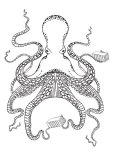

These notes are work in progress as I walk through the SE Tech Assessment.

# 1. Create Kubernetes cluster
I created the cluster on AWS (EKS) via Terraform.



# 2. Signup for a Sysdig Platform Trial
Done, no further details.

![[20220906134512.png]](img/20220906134512.png)

# 3. Install the Sysdig Agent(s)
Installed "Secure for Cloud" via Terraform, sysdig-agent via Helm.

Issues: I did have some issues trying to deploy "Secure for Cloud" via Cloudformation (regular as well as the lightweight template using AppRunner) on my existing AWS account:

Lightweight AppRunner Deployment:
```
2022-09-05 14:49:51 UTC+0200
Sysdig-CloudVision-CloudConnectorStack-1FJN85BBQYR3V
CREATE_FAILED
The following resource(s) failed to create: [CloudConnectorAppRunner].
2022-09-05 14:49:49 UTC+0200

CloudConnectorAppRunner
CREATE_FAILED
Resource handler returned message: "null" (RequestToken: XXXXXXXX-XXXX-XXXX-XXXX-XXXXXXXXXXXX, HandlerErrorCode: null)
```

Using the regular (non-AppRunner) CF template did not complete within an hour (tried multiple times and in different regions), it was stuck with creating the CloudConnector-Substack, so I aborted/deleted the stack. Issue might be related to globally (cross-region) existing resources, but not 100% sure.
Terraform also kept failing at some point with `400 Bad Request` an error (terraform logs with log level `trace` are available).

Created a **new AWS account** and re-run via Terraform, worked without issues.

![[20220906134512.png]](img/20220906134512.png)

# 4. Deploy sample app

Deployed the `example-voting-app` as per instructions in the repo's readme.

Note that there is an issue with the instructions:

Strictly following:
```
$ kubectl create namespace vote
$ kubectl create -f k8s-specifications/
```
will throw an error `namespaces "vote" already exists`:
```
kubectl create -f k8s-specifications/
deployment.apps/db created
service/db created
deployment.apps/redis created
service/redis created
deployment.apps/result created
service/result created
deployment.apps/vote created
service/vote created
deployment.apps/worker created
Error from server (AlreadyExists): error when creating "k8s-specifications/vote-namespace.yml": namespaces "vote" already exists
```

Solution: remove `k8s-specifications/vote-namespace.yml`

![[20220906134512.png]](img/20220906134512.png)

# 5. Get Creative and build some stuff in Sysdig

## Sysdig Secure:

### Scan the images being loaded, what do the results mean?
Scanning the images via CLI:
```
SECURE_API_TOKEN=xxxxxxxx-xxxx-xxxx-xxxx-xxxxxxxxxxxx ./sysdig-cli-scanner --apiurl https://eu1.app.sysdig.com example-voting-app-worker --policy sysdig_best_practices

SECURE_API_TOKEN=xxxxxxxx-xxxx-xxxx-xxxx-xxxxxxxxxxxx ./sysdig-cli-scanner --apiurl https://eu1.app.sysdig.com example-voting-app-result --policy sysdig_best_practices

SECURE_API_TOKEN=xxxxxxxx-xxxx-xxxx-xxxx-xxxxxxxxxxxx ./sysdig-cli-scanner --apiurl https://eu1.app.sysdig.com example-voting-app-vote --policy sysdig_best_practices

```

The example result below tells us the following:

Information about the image, its base OS, and the number of vulnerabilities, grouped by severity.  It also shows which of the found vulnerabilities are actually fixable (usually by upgrading the package to the next higher version that is not affected by the issue, preferably resulting only in a minor upgrade to avoid breaking changes).

Example: the `curl` library in version `7.64.0-4+deb10u2` is vulnerable due to 14 different CVEs, of which none are critical but 4 are high - however, no known exploit is recorded.
The suggested fix is to upgrade to version `7.64.0-4+deb10u3` .

The image scan fails due to the existing high severe issues, which cause the scan to not pass the policy `Sysdig Best Practices FAILED` , because high severe vulnerabilities with a fix exist (as defined in the policy).

```
$ SECURE_API_TOKEN=xxxxxxxx-xxxx-xxxx-xxxx-xxxxxxxxxxxx ./sysdig-cli-scanner --apiurl https://eu1.app.sysdig.com example-voting-app-worker --policy sysdig_best_practices
2022-09-05T20:12:00+02:00 Starting analysis with Sysdig scanner version 1.2.6-rc
2022-09-05T20:12:00+02:00 Retrieving vulnerabilities DB...
2022-09-05T20:12:00+02:00 Done, using cached DB
2022-09-05T20:12:00+02:00 Loading vulnerabilities DB...
2022-09-05T20:12:00+02:00 Done
2022-09-05T20:12:00+02:00 Retrieving image...
2022-09-05T20:12:11+02:00 Done
2022-09-05T20:12:11+02:00 Scan started...
2022-09-05T20:12:12+02:00 Uploading result to backend...
2022-09-05T20:12:12+02:00 Done
2022-09-05T20:12:12+02:00 Total execution time 11.921106415s

Type: dockerImage
ImageID: sha256:28dc3586bffff9103943fd79d45db93f4ef4775e07319a702000d4761319e49d
Digest:
BaseOS: debian 10.12
PullString: example-voting-app-worker

174 vulnerabilities found
10 Critical (0 fixable)
35 High (8 fixable)
22 Medium (8 fixable)
31 Low (4 fixable)
76 Negligible (0 fixable)

  PACKAGE   TYPE      VERSION        SUGGESTED FIX    CRITICAL  HIGH  MEDIUM  LOW  NEGLIGIBLE  EXPLOIT  
  curl       os   7.64.0-4+deb10u2  7.64.0-4+deb10u3     0       4      5      3       2          0     
  libcurl4   os   7.64.0-4+deb10u2  7.64.0-4+deb10u3     0       4      5      3       2          0     

                   POLICIES EVALUATION
    Policy: Sysdig Best Practices FAILED (38 failures)

Policies evaluation FAILED at 2022-09-05T20:12:12+02:00
Full image results here: https://eu1.app.sysdig.com/secure/#/scanning/assets/results/17120962cc0809ac4a560ee91f8770fa/overview (id 17120962cc0809ac4a560ee91f8770fa)
Execution logs written to: /home/mconradt/Documents/sysdig/scan-logs
```

Sysdig Best Practices Rule:
![[20220905220850.png]](img/20220905220850.png)

Image scan results in the UI:
![[20220905233940.png]](img/20220905233940.png)

### Posture? What's up with those?

Checks the infrastructure, workloads, for compliance (CIS, NIST, SOC2, ISO27001, etc.)

### Enable Runtime Policies, generate some noise (how might you do that?)

(1) I enabled a custom **Drift Detection** policy that triggers when an executable is run that wasn't originally part of the image/container, or when "top" is being run (I took this example from the training videos):

![[20220905221900.png]](img/20220905221900.png)

In order to trigger the policy, I `bash` into a running container, install `curl` and run it.

```
$ kubectl exec --namespace=vote -it result-86d8966d87-hw9xp /bin/bash
$ apt update
$ apt install curl
$ curl http://example.com
```

Events are shown and the Activity Audit also shows the activity (in this case: network activity, file operations as well as command executions).

![[20220905221650.png]](img/20220905221650.png)

![[20220905221618.png]](img/20220905221618.png)

(2) I created a second custom **"Runtime Security in Container"** policy that alerts when a shell is spawn inside a container.

![[20220905221352.png]](img/20220905221352.png)

This already triggers right away when bashing into the container.

```
$ kubectl exec --namespace=vote -it result-86d8966d87-hw9xp /bin/bash
```


(3) Enabled **"Sysdig Runtime Notable Events"** incl. **"Execution from /tmp"**:

![[20220906001043.png]](img/20220906001043.png)

![[20220906001311.png]](img/20220906001311.png)

Triggering the policy via:

```
$ kubectl exec --namespace=vote -it result-86d8966d87-hw9xp /bin/bash
$ cp /bin/ls /tmp/
$ /tmp/ls
```

![[20220906001328.png]](img/20220906001328.png)

(4) I enabled standard policy **"Sysdig AWS Notable Events"** and then logged into the AWS Console with an account without MFA, however, this policy did not trigger.
Not seeing it anywhere under "Events" nor "Insights" nor did I get an email notification (as enabled).

![[20220905225718.png]](img/20220905225718.png)

The same happened (or did NOT happen actually) when creating an access key for that same user.

![[20220905225902.png]](img/20220905225902.png)

Looking into AWS CloudTrail, a `CreateAccessKey` event is logged though. I'm not sure yet what's missing.

![[20220905230837.png]](img/20220905230837.png)

---

### Activity audit! Why's that valuable?
Shows activity (grouped by activity type such as command execution, network activity, file operations, Kubernetes) in a timeline, which can be filtered further.
Selecting any activity shows details of the event.
The activity audit helps with reconstructing how a malicious actor might have compromised a system; collecting evidence and traces.

![[20220905235542.png]](img/20220905235542.png)

## Sysdig Monitor

### Build a PromQL query using the query builder in the explore section of Sysdig Monitor using metrics from the Voting App (bonus points if you use StatsD metrics in a PromQL query)
To do.

### Build a dashboard with your query + static metrics from Sysdig that relate multipule things together
To do.

For now I picked a standard query from the PromQL library. Need to dive a bit deeper into Prometheus and pick metrics that make sense together.

![[20220906134807.png]](img/20220906134807.png)


### Add views to the dashboard that might be interesting to a user
To do.

![[20220906134512.png]](img/20220906134512.png)

# 6. Don't destroy your cluster! We'd like to look at it with you
Noted.

![[20220906134512.png]](img/20220906134512.png)

# 7. Feedback?

## How can we get better?
**- Training/Learn/Docs:**
	- Training videos (training.sysdig.com) and docs (UI, Features) are not always aligned with actual UI/product, especially around **Admission Controller** and **Image Scanning**.
	- Training videos (training.sysdig.com): they are grouped by years 2020-2022, however it's not clear which ones are actually still relevant, some videos appear under each year (would it make sense to delete irrelevant / outdated ones from previous years then?)
	- Videos/sessions should be marked as "viewed" if they are re-used at different places and have already been watched

**- User Management / Login:**
- **User Invite**: it's not possible to invite other users that already have a Sysdig account (so a user cannot be part of multiple orgs / Sysdig accounts)

- **Login**: the region selector is a bit confusing, especially with the login not working for any region, but the Sysdig CLI only pointing to the generic (not region-specific endpoints). Might be better to have a central login that works across all regions and after the login happened, the proper redirection to the respective region and app happens.
![[20220905234331.png]](img/20220905234331.png)

---
- **Getting Started**
The Sysdig Secure inline **"Getting Started"** guide does not complete (or it's unclear how to); sometimes tasks don't complete (sometimes they do), such as image scanning - have not found the pattern behind it yet

  ![[20220905235624.png]](img/20220905235624.png)

---
- **Sysdig Secure**: there is no way to delete old/unused resources (clean up) like cloud accounts, agents, etc. from the UI.
  https://eu1.app.sysdig.com/secure/#/data-sources/agents
  https://eu1.app.sysdig.com/secure/#/data-sources/managed-kubernetes  

  ![[20220906003749.png]](img/20220906003749.png)

---
- **Sysdig Monitor**: Integrations section does not have a "Agents" list like Sysdig Secure has; would expect the same here as both also have the "Agent Installation" item.

  ![[20220906004134.png]](img/20220906004134.png)
---
- **Admission Controller: unclear how to enable it via UI and add an AC policy**

The docs for the Adminission Controller as mentioned in the last step of the onboarding steps do not seem to be up to date. 

For example on [https://docs.sysdig.com/en/docs/installation/admission-controller-installation/#admission-controller-installation](https://docs.sysdig.com/en/docs/installation/admission-controller-installation/#admission-controller-installation) it says to enable the Admission Controller in the "Sysdig Labs" profile settings, however, this option does not exist (current UI differs from screenshot shown in docs).

All I see is this, which looks different from the screenshot in above linked docs:
![[20220906094837.png]](img/20220906094837.png)

Also the path mentioned in the docs:

> Log in to Sysdig Secure and select Image Scanning>Admission Controller|Policy Assignments." does not exist in the Sysdig Secure UI.

FYI - I had sent this issue before to support, who connected me with Stefan Gavrilov (Dach AE).

---
- **Sysdig Secure > Data Sources:** not clear why the AWS Account ID is not always shown

![[20220905192645.png]](img/20220905192645.png)

Update (a day later): it seems that there is some delay having the AWS Account ID populated. I now see the AWS Account for above marked agents:

![[20220906122909.png]](img/20220906122909.png)

---
- **Sysdig Secure > Network**: not all services in the cluster are shown in the UI:

![[20220905212930.png]](img/20220905212930.png)

Same for Deployments:

![[20220905213031.png]](img/20220905213031.png)

---
- **Sysdig Secure > Network:** the instructions on this screen are not very clear. Would be good to have a link to docs. What kind of labels? What should the `key:value` be?

![[20220905230257.png]](img/20220905230257.png)

---
- **Sysdig Secure > Get Started**: this link leads to a 404 / page not found:

![[20220905234117.png]](img/20220905234117.png)

---
- **Sydig Secure > Insights: Not getting data**

I have a cloud account (AWS) connected, as well as the managed Kubernetes cluster and agents showing as active in Sysdig > Integrations > Data Sources, but still the Insights > Cloud Activity shows as "Paused" in the bottom bar and only shows old data of a meanwhile disconnected AWS account (AWS Account ID 992674152027), but no data of my actual currently connected AWS account (AWS Account ID 452685815011).

For testing purposes, today (Sep 6) I created and deleted a KMS key in the active AWS account and region, but this event is not being picked up. I only see an old Key Deletion of Aug 23, which happened in another AWS account that is not connected with Sysdig anymore.

![[20220906103751.png]](img/20220906103751.png)

![[20220906104238.png]](img/20220906104238.png)

---
- **Sysdig Monitor > Explore > PromQL Query**

The "Create" button does not do anything, despite changing its color when hovering over it with the mouse. Both buttons have issues with mouse hovering though (Brave browser, Linux).
I'd expect a submenu opening up due the three dots on the button, but nothing happens.

![[20220906123743.png]](img/20220906123743.png)

---
- **Falco**: (Not related to any task for the example-voting-app, just something I stumbled across earlier on) I tried to build Falco / driver from source on Manjaro (my primary system), as no Arch-build is available, and wanted to deploy it on minikube. However, ran in an undocumented issue about a schema version. I checked the issues on Github, but while there were some around minikube, none mentioned this specific error message.

```
Mon Aug 29 19:30:23 2022: Runtime error: Driver supports schema version 1.0.0, but running version needs 2.0.0. Exiting.
```

Detail:   
```
* Looking for a falco module locally (kernel 5.19.1-3-MANJARO)
* Trying to download a prebuilt falco module from https://download.falco.org/driver/2.0.0%2Bdriver/x86_64/falco_manjaro_5.19.1-3-MANJARO_1.ko
[...]
Consider compiling your own falco driver and loading it or getting in touch with the Falco community
╭─mconradt@cathedral /home/mconradt/falco/build  ‹system›  <master>
╰─$ sudo insmod driver/falco.ko                                                                                                      

╭─mconradt@cathedral /home/mconradt/falco/build  ‹system›  <master>
╰─$ minikube start --driver=virtualbox
😄  minikube v1.26.1 on Arch 21.3.7
🆕  Kubernetes 1.24.3 is now available. If you would like to upgrade, specify: --kubernetes-version=v1.24.3
✨  Using the virtualbox driver based on existing profile
👍  Starting control plane node minikube in cluster minikube
🔄  Restarting existing virtualbox VM for "minikube" ...
🐳  Preparing Kubernetes v1.24.1 on Docker 20.10.16 ...
    ▪ Using image gcr.io/k8s-minikube/storage-provisioner:v5
🔎  Verifying Kubernetes components...
🌟  Enabled addons: storage-provisioner, default-storageclass
🏄  Done! kubectl is now configured to use "minikube" cluster and "default" namespace by default
╭─mconradt@cathedral /home/mconradt/falco/build  ‹system›  <master>
╰─$ kubectl logs falco-l4tdp
Defaulted container "falco" out of: falco, falco-driver-loader (init)
Mon Aug 29 19:30:22 2022: Falco version 0.32.2
Mon Aug 29 19:30:22 2022: Falco initialized with configuration file /etc/falco/falco.yaml
Mon Aug 29 19:30:22 2022: Loading rules from file /etc/falco/falco_rules.yaml:
Mon Aug 29 19:30:23 2022: Loading rules from file /etc/falco/falco_rules.local.yaml:
Mon Aug 29 19:30:23 2022: Starting internal webserver, listening on port 8765
Mon Aug 29 19:30:23 2022: Unable to load the driver.
Mon Aug 29 19:30:23 2022: Runtime error: Driver supports schema version 1.0.0, but running version needs 2.0.0. Exiting.
```

## How did you experience with Sysdig differ from your experience of any other similar solutions?
via 1:1 feedback session

## What suggestions do you have on this process?
via 1:1 feedback session

## What tasks could be different or better?
via 1:1 feedback session
